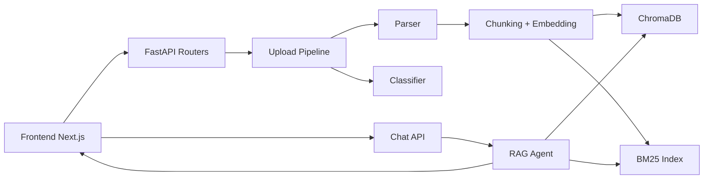

# Document Intelligence + Agentic RAG


A full-stack app for document ingestion, parsing, classification, indexing, and grounded Q&A with citations.

## Why this project

This repository gives you a complete pipeline:

- Upload PDFs, text files, and images
- Extract and normalize content (including OCR fallback)
- Classify documents with Groq (llama-3.1-8b-instant)
- Index chunks for semantic + lexical retrieval
- Ask questions and get answers with inline citations and page previews

## Highlights

- FastAPI backend with clear route separation
- Next.js 14 frontend with upload, chat, and document preview workflows
- ChromaDB vector store plus BM25 keyword retrieval
- Streaming and non-streaming chat endpoints
- Startup auto-indexing of sample docs for instant local demo
- Practical Windows-first run guidance

## Demo and Screenshots

Use this section for quick visual orientation when you share the project.

Suggested captures:

1. Landing page (`frontend/app/page.tsx`)
2. Upload workflow with progress states
3. Chat response showing inline citations
4. Document preview modal with page navigation


```

## Architecture



## Repository Layout

```text
backend/
  main.py                  FastAPI app entrypoint
  limiter.py               Shared rate limiter
  requirements.txt         Python dependencies
  models/                  Request and response models
  routers/                 upload, chat, documents endpoints
  services/                parser, classifier, embedder, vector store, rag agent
  sample_docs/             Auto-indexed samples
  storage/                 Uploaded files, metadata, pages
frontend/
  package.json             Next scripts and deps
  app/                     App Router pages
  components/              Reusable UI modules
  lib/                     API client and local storage helpers
```

## Tech Stack

- Backend: FastAPI, Uvicorn, Pydantic, SlowAPI
- Parsing: PyMuPDF, pdfplumber, EasyOCR
- Retrieval: sentence-transformers, ChromaDB, BM25
- LLM: Groq (`groq` SDK) — llama-3.3-70b-versatile (RAG) + llama-3.1-8b-instant (classification)
- Frontend: Next.js 14, React 18, TypeScript, Tailwind CSS

## Prerequisites

- Python 3.10+
- Node.js 18+
- Groq API key (free at https://console.groq.com)

## Copy-Paste Quickstart

Run backend in one terminal:

```powershell
cd backend
python -m venv .venv
powershell -ExecutionPolicy Bypass -File .venv\Scripts\Activate.ps1
pip install -r requirements.txt
python -m uvicorn main:app --host 0.0.0.0 --port 8000 --reload
```

Run frontend in another terminal:

```powershell
cd frontend
npm.cmd install
npm.cmd run dev
```

Open:

- Frontend: http://localhost:3000
- Backend docs: http://localhost:8000/docs

## Quick Start

### 1. Backend

```bash
cd backend
python -m venv .venv
powershell -ExecutionPolicy Bypass -File .venv\Scripts\Activate.ps1
pip install -r requirements.txt
python -m uvicorn main:app --host 0.0.0.0 --port 8000 --reload
```

Command Prompt activation alternative:

```bat
.venv\Scripts\activate.bat
```

### 2. Frontend

If PowerShell blocks `npm.ps1`, use `npm.cmd` or `cmd.exe`:

```powershell
cd frontend
npm.cmd install
npm.cmd run dev
```

Alternative:

```bash
cd frontend
C:\Windows\System32\cmd.exe /c "npm install"
C:\Windows\System32\cmd.exe /c "npm run dev"
```

### 3. Open

- Frontend: http://localhost:3000
- Backend docs: http://localhost:8000/docs
- Backend health: http://localhost:8000/health

## First 5 Minutes Validation

1. Start backend and frontend.
2. Open chat page from the UI.
3. Ask a question against sample documents.
4. Confirm response contains inline citations like `[DocName, Page N]`.
5. Open document preview and verify page image loads.

## Configuration

### Backend `.env`

Create `backend/.env` with at least:

```env
GROQ_API_KEY=your_groq_api_key_here
ALLOWED_ORIGINS=http://localhost:3000
FRONTEND_URL=http://localhost:3000
MAX_FILE_SIZE_MB=20
```

Get a free Groq API key at https://console.groq.com → API Keys → Create API Key.

### Frontend `.env.local`

```env
NEXT_PUBLIC_API_URL=http://localhost:8000
```

## API Overview

| Method | Endpoint | Purpose |
|--------|----------|---------|
| POST | `/upload` | Upload one document |
| POST | `/bulk-upload` | Upload multiple documents |
| GET | `/status/{doc_id}` | Check processing status |
| POST | `/chat` | Ask question and get full response |
| POST | `/chat/stream` | Stream response with SSE |
| GET | `/documents` | List indexed docs |
| GET | `/documents/{doc_id}` | Get document metadata |
| DELETE | `/documents/{doc_id}` | Delete document |
| POST | `/documents/{doc_id}/reindex` | Re-index document |
| GET | `/page-image` | Get rendered page image |
| GET | `/health` | Service health and index count |

## Core Behavior

### Upload and Parsing

- Uses SHA-256 content hashing for safe, deduplicated storage
- Validates extension, Content-Type, and byte-level MIME when available
- Scans PDFs for suspicious markers before processing
- Falls back to OCR when a page lacks extractable text

### Retrieval and Answering

- Semantic retrieval from ChromaDB
- BM25 lexical retrieval complement
- Reranking for final context quality
- Inline citation extraction and page linkage

### Frontend Experience

- Upload flow with per-file progress states
- Chat with citation cards and follow-up prompts
- Document sidebar with delete, reindex, and preview actions
- Markdown export for chat transcripts

## Security Notes

- Rate limits applied to upload and chat routes
- File size constraints enforced during upload
- Page image endpoint validates `doc_id` and resolved path
- Security headers added on backend responses
- CORS behavior controlled by environment settings

## Troubleshooting

### PowerShell blocks npm

Use `npm.cmd`:

```powershell
npm.cmd install
npm.cmd run dev
```

### `python-magic` missing on Windows

The backend still starts. Upload validation gracefully falls back to extension and header checks when `python-magic` is unavailable.

### Frontend cannot reach backend

- Ensure backend is running on `:8000`
- Ensure `NEXT_PUBLIC_API_URL` points to the backend URL
- Confirm CORS settings allow frontend origin

### Slow first startup

Expected on first run because model downloads and index warmup can take time.

### No relevant documents found

The RAG system retrieves chunks by semantic similarity — not by filename. Instead of asking "What is in Report.pdf?", ask about the content directly e.g. "Summarize the financial report" or "What are the key findings in the research paper?"

## Deployment

This repository currently documents local-first development. If you want hosted deployment, use one of the options below.

### Option 1: Split deployment (recommended)

- Deploy backend FastAPI service to a VM, container platform, or managed Python host
- Deploy frontend Next.js app to Vercel or any Node-capable host
- Set frontend `NEXT_PUBLIC_API_URL` to the public backend URL
- Restrict backend CORS (`ALLOWED_ORIGINS`) to your frontend domain

### Option 2: Single-host deployment

- Run backend and frontend on the same host with a reverse proxy
- Route `/api` to backend and frontend traffic to Next.js
- Use process supervision (systemd, PM2, or platform equivalent)

### Option 3: Containerized deployment

Docker files are not included yet, but this project is container-friendly.

Suggested next steps:

1. Add `backend/Dockerfile` for FastAPI + Uvicorn
2. Add `frontend/Dockerfile` for Next.js production build
3. Add `docker-compose.yml` for local orchestration
4. Add `.env` and secret handling strategy for production keys

### Production checklist

- Use strong secret management for Groq credentials
- Set explicit CORS origins (do not use wildcard)
- Run behind HTTPS and a reverse proxy
- Configure logging and error monitoring
- Add health checks and restart policies
- Pin dependency versions and monitor security advisories

## Development Commands

Backend:

```bash
cd backend
python -m uvicorn main:app --reload --port 8000
```

Frontend:

```bash
cd frontend
npm run dev
npm run build
npm run lint
```

## Notes for Maintainers

- `backend/main.py` performs startup warmups and sample auto-indexing.
- `backend/routers/upload.py` handles upload security checks and background processing kickoff.
- `backend/services/rag_agent.py` controls retrieval orchestration and final answer synthesis.
- `frontend/lib/api.ts` is the central API client used by UI components.

## License

No license file is currently included in this repository. Add one before public distribution.
